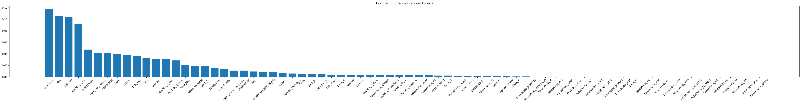
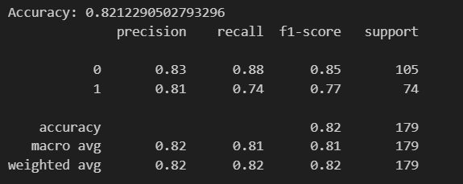
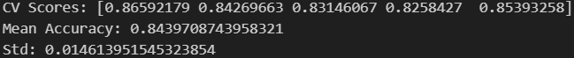
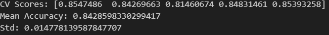

# 🚢 Titanic Survival Prediction (Advanced Feature Engineering & Ensemble Learning)

This project is an end-to-end machine learning pipeline built on the Titanic dataset from Kaggle.  
It focuses on **advanced feature engineering**, **model comparison**, and **ensemble learning techniques**.

---

## 📌 Objective

Predict whether a passenger survived the Titanic disaster using structured passenger data.

---

## 📊 Exploratory Data Analysis (EDA)

Key insights discovered during analysis:

- Gender had a strong impact on survival (female passengers had higher survival rate)
- Passenger class significantly influenced survival probability
- Family size affected survival (small families performed better than single or very large families)
- Age groups showed strong survival differences (children had higher survival rates)
- Fare and socio-economic status were highly correlated with survival

---

## 🧠 Feature Engineering (Advanced Level)

This project includes extensive feature engineering:

### 👤 Identity Features
- Title extraction from Name (Mr, Mrs, Miss, Rare)
- SexTitle interaction feature
- Child indicator
- Mother indicator

### 👨‍👩‍👧 Family Features
- FamilySize
- IsAlone
- SmallFamily / LargeFamily
- FamilyCategory

### 🎟 Ticket Features
- TicketPrefix extraction
- TicketGroupSize

### 🛳 Cabin Features
- Deck extraction from Cabin

### 💰 Fare Features
- Fare log transformation
- Fare per person
- Fare binning (Low → Very High)

### 🎂 Age Features
- Age binning (Child → Senior)

### 🔗 Interaction Features
- Sex × Pclass
- Age × Pclass
- Pclass × Fare_log

    

---

## 🤖 Models Used

Three machine learning models were trained and compared:

- Logistic Regression
- Random Forest Classifier
- XGBoost Classifier

---

## 📈 Model Evaluation

### 📊 Logistic Regression Baseline

    

### 🌲 Feature Importance (Random Forest)

Random Forest feature importance analysis was performed to understand key drivers of survival.

    
    
---

## 📊 Cross Validation (XGBoost)

Stratified K-Fold Cross Validation was used for robust evaluation.

Example result:

    
    

---

## 🤝 Ensemble Learning (Voting Classifier)

A soft voting ensemble was built using:

- Logistic Regression
- Random Forest
- XGBoost

This improved model stability and robustness.

    

---

## ⚙️ Workflow Summary

1. Data Cleaning
2. Missing Value Imputation (including ML-based Age prediction)
3. Feature Engineering (extensive)
4. Encoding categorical variables
5. Model training
6. Cross validation
7. Ensemble learning

---

## 🛠 Technologies Used

- Python
- Pandas
- NumPy
- Matplotlib
- Seaborn
- Scikit-learn
- XGBoost

---

## 📁 Project Structure

01_titanic_survival/
│
├── notebooks/
│ ├── 01_eda_titanic.ipynb
│ └── 02_preprocessing_titanic.ipynb
│
├── data/
│ ├── train.csv
│ └── test.csv
│
├── data/
│ ├── FeatureImportance.png
│ ├── LogisticRegression.png
│ ├── RandomForest.png
│ ├── VotingEnsemble.png
│ └── XGBoostCrossValidation.png
│
└── README.md

---

## 🧠 Key Learnings

- Advanced feature engineering techniques
- Handling missing data using ML (RandomForest imputation)
- Encoding categorical variables correctly
- Model comparison and evaluation
- Cross-validation strategies
- Ensemble learning (soft voting)

---

## 📌 Final Notes

This project demonstrates a full machine learning pipeline from raw data to model evaluation and ensemble learning.

It serves as a strong foundation for more advanced projects in:
- Regression problems
- NLP pipelines
- Real-world ML systems
