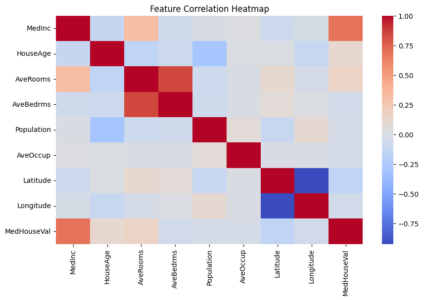
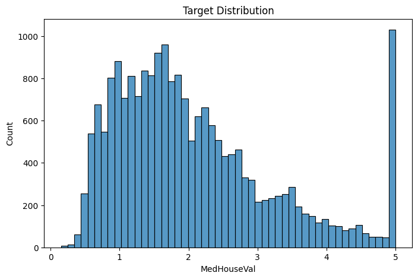
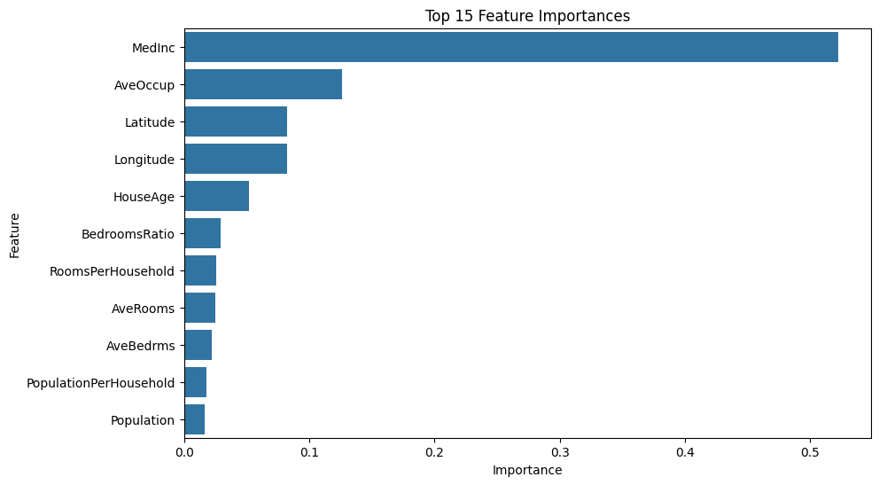
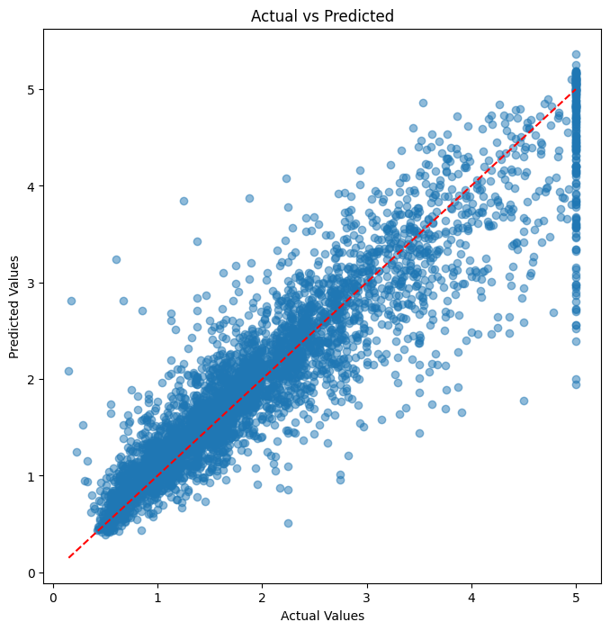
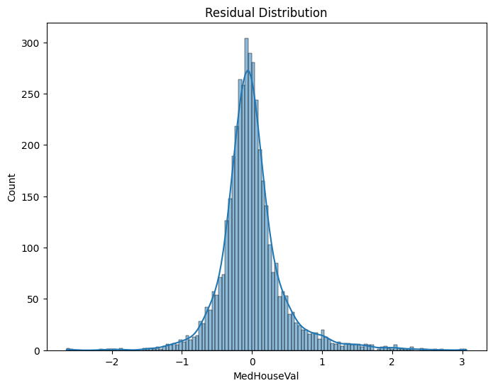

# California Housing Price Prediction

A complete Machine Learning project for predicting California housing prices using the California Housing Dataset.

---

## Project Goal

The objective of this project is to predict median house values in California districts using demographic, geographic, and housing-related features.

The project follows a complete machine learning workflow including:

* Data exploration
* Feature engineering
* Visualization
* Model training
* Model evaluation
* Model interpretation

---

## Dataset

California Housing Dataset

Target Variable:

* MedHouseVal

Features:

* MedInc
* HouseAge
* AveRooms
* AveBedrms
* Population
* AveOccup
* Latitude
* Longitude

---

## Project Structure

```text
data/
images/
notebooks/
src/
README.md
```

---

## Exploratory Data Analysis

Performed analyses:

* Dataset overview
* Missing value inspection
* Correlation analysis
* Distribution analysis
* Outlier detection
* Target variable analysis

### Correlation Heatmap



### Target Distribution



---

## Feature Engineering

Created additional features:

* RoomsPerHousehold
* BedroomsRatio
* PopulationPerHousehold

Applied:

* Log transformation
* Feature interaction analysis

---

## Models

### Linear Regression

| Metric | Value |
| ------ | ----- |
| MAE    | 0.487 |
| RMSE   | 0.674 |
| R²     | 0.654 |

### Random Forest

| Metric | Value |
| ------ | ----- |
| MAE    | 0.328 |
| RMSE   | 0.504 |
| R²     | 0.807 |

### XGBoost

| Metric | Value |
| ------ | ----- |
| MAE    | 0.304 |
| RMSE   | 0.460 |
| R²     | 0.838 |

---

## Feature Importance

The most important feature was Median Income (MedInc), followed by geographic features and occupancy-related variables.



---

## Prediction Analysis

### Actual vs Predicted



The predictions closely follow the ideal diagonal line, indicating strong predictive performance.

---

## Residual Analysis

### Residual Distribution



Residuals are approximately centered around zero, suggesting that the model does not exhibit strong systematic bias.

---

## Final Result

Best Model: XGBoost

Performance:

* MAE = 0.304
* RMSE = 0.460
* R² = 0.838

The model successfully explains approximately 84% of the variance in California housing prices.

---

## Technologies

* Python
* Pandas
* NumPy
* Matplotlib
* Seaborn
* Scikit-Learn
* XGBoost

---

## Author

Amir Hossein Forootan
