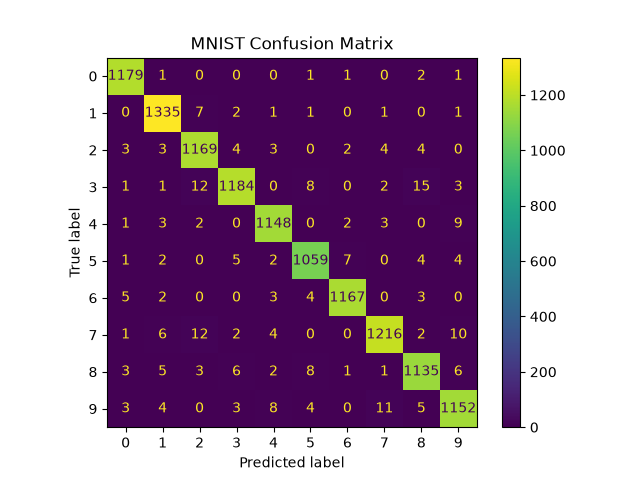
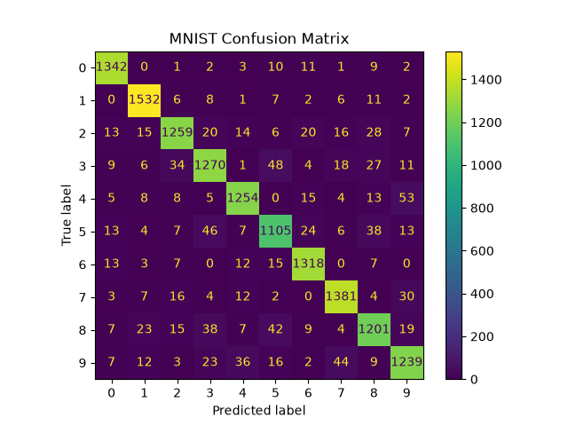
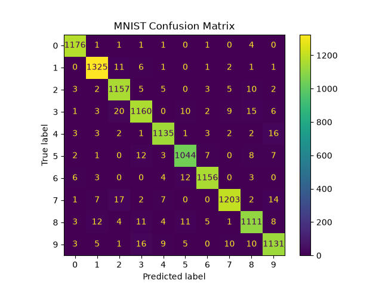
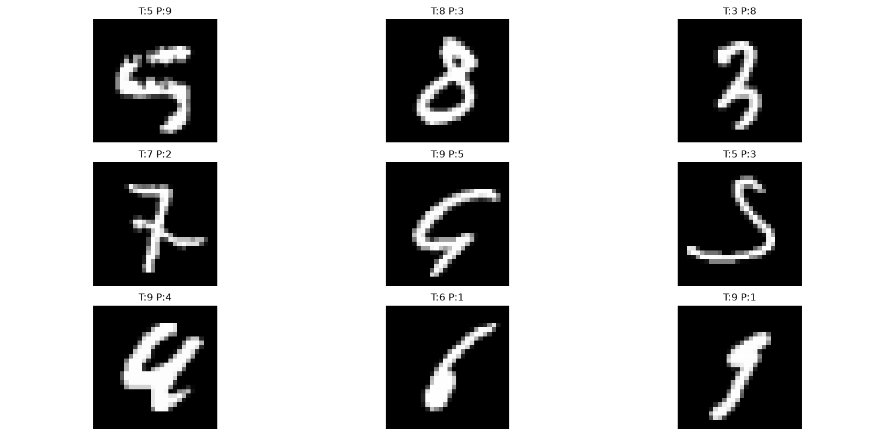

# MNIST Digit Classification

A machine learning project for handwritten digit recognition using the MNIST dataset. Multiple classification algorithms were implemented, evaluated, and compared using a modular and object-oriented architecture.

---



## Project Overview

The goal of this project is to classify handwritten digits (0-9) from grayscale images using traditional machine learning techniques.

The project follows a modular design with separate components for:

- Data Loading
- Data Analysis
- Data Preprocessing
- Model Training
- Model Evaluation
- Visualization
- Model Comparison
- Model Persistence

Three machine learning models were trained and evaluated:

- Logistic Regression
- Random Forest
- Support Vector Machine (SVM)

---

## Dataset

MNIST (Modified National Institute of Standards and Technology)

Dataset Characteristics:

- 70,000 handwritten digit images
- 28 × 28 grayscale pixels
- 784 features per sample
- 10 classes (digits 0-9)

Class Labels:

```text
0, 1, 2, 3, 4, 5, 6, 7, 8, 9
```

---

## Project Structure

```text
03_MNIST_Digit_Classification/

├── images/
│   ├── logistic_confusion_matrix.png
│   ├── random_forest_confusion_matrix.png
│   ├── svm_confusion_matrix.png
│   └── svm_misclassified_samples.png
│
├── data/
│
├── saved_models/
│   └── svm_model.pkl
│
├── src/
│   │
│   ├── models/
│   │   ├── logistic_regression_model.py
│   │   ├── random_forest_model.py
│   │   └── svm_model.py
│   │
│   ├── preprocessing/
│   │   └── preprocessor.py
│   │
│   ├── analyzer.py
│   ├── config.py
│   ├── data_loader.py
│   ├── evaluator.py
│   ├── model_comparator.py
│   ├── model_saver.py
│   ├── pipeline.py
│   └── visualizer.py
│
├── main.py
├── requirements.txt
└── README.md
```

---

## Data Preprocessing

The following preprocessing steps were applied:

- Pixel normalization from [0,255] to [0,1]
- Train/Test split
- Stratified sampling to preserve class distribution

---

## Models Evaluated

| Model | Accuracy |
|---------|---------:|
| Logistic Regression | 92.10% |
| Random Forest | 96.65% |
| SVM (RBF Kernel) | **97.87%** |

---

# Logistic Regression

Accuracy: **92.10%**

### Confusion Matrix



---

# Random Forest

Accuracy: **96.65%**

### Confusion Matrix



---

# Support Vector Machine (SVM)

Accuracy: **97.87%**

### Confusion Matrix


---

## Best Model

The best performing model was:

### Support Vector Machine (RBF Kernel)

```text
Accuracy: 97.87%
```

Compared to Logistic Regression:

```text
Improvement: +5.77%
```

Compared to Random Forest:

```text
Improvement: +1.22%
```

---

## Error Analysis

To better understand model behavior, misclassified samples from the best model (SVM) were visualized.

### Misclassified Samples



### Observations

Most classification errors occurred between visually similar digits:

```text
3 ↔ 5
5 ↔ 8
8 ↔ 9
```

Many incorrectly classified samples were also challenging for human interpretation, indicating that the model errors often occurred on ambiguous handwriting samples.

---

## Evaluation Methods

The following metrics and visualizations were used:

- Accuracy Score
- Classification Report
- Precision
- Recall
- F1-Score
- Confusion Matrix
- Misclassified Sample Analysis

---

## Technologies Used

- Python
- NumPy
- Pandas
- Scikit-Learn
- Matplotlib
- Joblib

---

## Model Persistence

The best trained model is saved locally:

```text
saved_models/svm_model.pkl
```

This allows inference without retraining the model.

---

## Future Improvements

Possible future extensions include:

- Hyperparameter Tuning
- Grid Search
- Cross Validation
- PCA Dimensionality Reduction
- Deep Learning (CNN)
- GPU Acceleration

---

## Author

Amir Forootan

Machine Learning Fundamentals Project Series